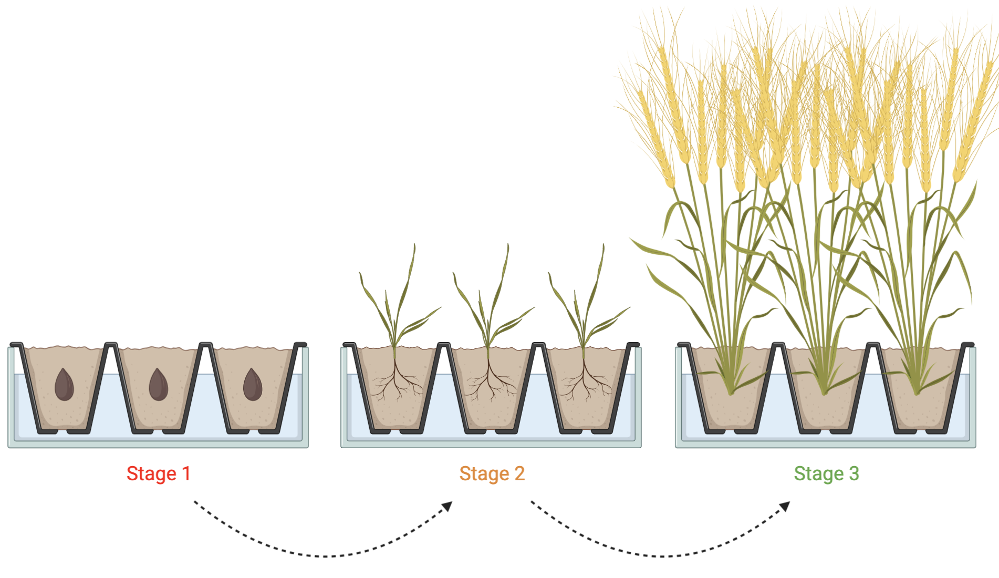

<br>

### Contents:
- Using custom containers for different steps of the pipeline
- Increasing resources for some processes
- Changing arguments for different modules
    - Reducing parallelism for controlled experiments
    - Max cpu/time/memory of the pipeline and processes
- Pipeline to be optimized  [`nfcore/methylseq`](https://nf-co.re/methylseq)

Training Resources:

- [nf-core pipeline configuration docs](https://nf-co.re/usage/configuration)
 
- [Nextflow training](https://training.nextflow.io/basic_training/config/)

- [Nextflow reference for configurations](https://www.nextflow.io/docs/latest/config.html)

<br>

## Stage 1

### Custom `Configurations`
Custom `configuration` files are  a text file with a set of properties that allow for the decoupling of workflow implementations in `nextflow`. These `config` files provided the information regarding the resources needed, the schedulers that are used, and container options available. This allows for portable deployment of `nextflow` pipelines, without having to modify the original application code. Once any pipeline is launched `nextflow` looks for a `.config` file.

<br>

> Settings within `config` files come in `name=value` pairs, with the name being the property to set, and the value being any variable the user assigns to it.
>```console
> name = value
>```
>Config settings can use dot notations:
>```console
> params.input = ''
> params.outdir = './results'
>```
> Or brace notations:
>```console
>params {
>    input = ''
>    outdir = './results'
>}
>```

<br>

`Nextflow` pipelines are able to run on any computational infrastructure, while also supporting various containers (docker, singularity, conda, etc.). For any `nextflow` pipeline to run, all of these softwares and systems must be available _as well as_ a `.config` file for `nextflow` to know how best to run the pipeline on your system.

When a `nextflow` pipeline is launched, `nextflow` will look for the `configuration` file in multiple locations. If there are multiple `configuration` files, it is possible that there will be conflicting settings. Therefore configs are ranked, with those higher in the list taking priority for the `configuration` settings if multiple are available.

<br>

>
>Priority of configuration sources:
> - Parameters specified on the command line (`--something value`)
> - Paramteres provided using `-params-file`
> - `Config` file specified using the `-c my.config`
> - `Config` file named `nextflow.config` in the current directory
> - `Config` file named `nextflow.config` in the workflow project directory
> - `Config` file `$HOME/.nextflow/config`
> - values defined with the pipeline script itself (e.g. `main.nf`)

When more than one option for specifying a config is provided, they're merged, with some settings possibly overridden.

<br>

There are three different types of `custom configuration` files:
1. Basic pipeline `config` files
2. Shared `nf-core/configs` config profiles
3. `Custom conifguration` files 

#### **Basic**
---
This `config` comes with each `nf-core` pipeline and contains "sensible defaults" for resource requirements. This config is always loaded and generally overwritten by other prioritised `configs`.

With the basic `config` if the `-profile` is not specified, the pipeline will run locally and expect all software to be installed on the specified `PATH` (not recommended).

#### **Shared**
---
When using a shared system with other people (mainly regarding institute servers), it is best to use the `config` profile from [`nf-core/configs`](https://github.com/nf-core/configs) if available.

Best for widespread reproducibility and accepted protocols per institute.

#### **Custom**
---
`Custom configs` are used when only the person to be running the pipeline creates a local `config` file. An individually created and customised `config`. `Nextflow` will look for this `config` file in three places:
- Users `$HOME` directory: `~/.nextflow/config`
- Analysis working directory: `nextflow.config`
- Custom `PATH` specified on command line: `-c path/to/config` (multiple can be given)

`Configuration` parameters are loaded one after, and will overwrite previous values:
 1) Hardcoded pipeline defaults 
 2) Users `$HOME` directory
 3) Work directory
 4) Everey `-c` file in the order specified
 5) Command line `--<parameter>--` options


<br>

**References:**
- [`Nextflow` configuration training](https://training.nextflow.io/basic_training/config/#configuration-file)
- [The `Nextflow` `config` file](https://nextflow-io.github.io/elixir-workshop-21/docs/fifth.html)
- [Introduction to Bioinformatics workflows with `Nextflow` and `nf-core`](https://carpentries-incubator.github.io/workflows-nextflow/08-configuration/index.html)
- [Configuration](https://www.nextflow.io/docs/edge/config.html)
- [`nf-core` pipeline configuration](https://nf-co.re/usage/configuration)
- 
<br>

## Stage 2

### [`nfcore/methylseq`](https://nf-co.re/methylseq)

<br>

`nfcore/methylseq` is a Nextflow bioinformatic pipeline used for the analysis of methylation (bisulphite) sequencing data. The `nfcore/methylseq` pipeline is able to preprocess the raw data from raw fastq files, align the reads, and do further quality control analysis on the results.

`nfcore/methylseq` has multiple different workflows from which users can specify in the `config` file, these being Bismark, or bwa/meth and MethylDackel. The specfication for which workflow to use comes under the `--aligner` tag.

`nfcore/methylseq` requires pipeline parameters to be provided by either the command line, or through a Nextflow `-params-file`. Custom `config` files can be used to provide any specific confirgurations _except for parameters_.

<br>

#### **Usage**
`nfcore/methylseq` essentially contains two pipelines in one:
> - Default: Bismark with Bowtie2 as the alignment tool. HISAT2 can also be used through specifying in the command line.
> - Other: BWA-Meth and MethylDackel. For this pipeline the appropriate flag in command line must be used.

<br>

`nfcore/methylseq` requires the use of specific samplesheets created by the user containing their input fastq data as a .csv file with the headers sample, fastq_1, and fastq_2. `nfcore/methylseq` accepts both paired end and single end data input, and is able to recognise whether the input data is single end or paired end through the samplesheet alone (no specification required).

>Samplesheet:
>
>sample,fastq_1,fastq_2
>

<br>

To run the pipeline (specification of container required):

```

nextflow run nf-core/methylseq --input samplesheet.csv --outdir <OUTDIR> --genome GRCh37 -profile <CONTAINER>

```
The directories created:

```

work                # Directory containing the nextflow working files
<OUTDIR>            # Finished results in specified location (defined with --outdir)
.nextflow_log       # Log file from Nextflow
# Other nextflow hidden files, eg. history of pipeline runs and old logs.

```


<br>

#### **Parameters**
Parameters that are required by the pipeline include specifying the `--input` and `--output` directories, in which the `--input` is the path to the required samplesheet, and the `--outdir` is where the results will be deposiited.

Also required is the specification of the `--aligner`. The default option being Bismark, but if the other workflow is required it must be specified.

The remaining parameters can be adjusted depending on the aligher chosen, and other specifications.

#### **Output**
Output includes quality metrics in regards to the input fastq files, as well as coverage statistics and multiqc reports. Depending on the aligner chosen, associated reports and pipeline summaries will be produced.
<br>

**References:**
- [`nfcore/methylseq`](https://nf-co.re/methylseq)
- [`nfcore/methylseq` usage documents](https://nf-co.re/methylseq/2.4.0/usage)
- [`nfcore/methylseq` parameters](https://nf-co.re/methylseq/2.4.0/parameters)
- [`nfcore/methylseq` output](https://nf-co.re/methylseq/2.4.0/output)
- [`nfcore/methylseq` results](https://nf-co.re/methylseq/results#methylseq/results-81f989c93e866a9b0bd0d9584e077b9b8f78affe/)

<br>

## Stage 3

### `Configuration` training and resources
 <br>

> `-` configuration options for `nextflow`
> 
>`--` workflow paramaters defined in `params` scope
>

<br>

When running `nextflow` on your system:

#### **Executors**
---
The pipeline will run in local mode by default. Through your `custom config` you mus specify your executor.

#### **Multiple `configs`**
---
You are also able to combine multiple `configs` files that have been seperated through the statement `includeConfig`.

```console
// nextflow.config
params {
    input  = ''
    outdir = './results'
}

includeConfig 'system_resources.config'
```

#### **Max resources**
---
This specification aviods the failure of a pipeline due to not having enough resources for a process. The pipeline will check for the maximum parameters for memory, cpu, and time, with no single job exceeding these maximums. If a run fails due to a resource cap the pipeline will restart and extend the resources needed.

Caps avoid pipeline processes using too much resources and crashing the pipeline.

#### **Tuning workflow resources**
---
On initial runs, pipeline jobs are gievn generous resources, but users may adjust these to help with run efficiency, whether it be decreasing resources for a light process, or increasing resources to speed up a heavy process. These adjustments can be made on the rerun based on exit code message: lack/max resources.

Can adjust workflows through:
- _labels_ by which a task assigned: low, medium, or high process all changed in terms of resource allocations
- can be more specific by giving process name `withNAME`
- if pipeline uses a tool multiple times in a workflow, can specify the entire execution `PATH`

#### **Updating tool versions**
---
`Nextflow` DSL2 implementation of `nf-core` pipelines uses one container/conda environment per process. This allows for the management and maintanence of software versions and dependencies.

The `custom config` would need to identify the `process`, override the `container`/`conda` by `withNAME`, then pass the `custom.config` in the command line by `-c custom.config`.

```console
process {
        withName: NAME
            container/conda = 'Docker/Singularity/Conda'
        }
```
#### **Modifying tool arguments**
---
Most of the pipeline default arguments will be defined in `conf/modules.conf`. To modify which parameters are used by any given tool, can use the `ext.args` command. If this process in the software is not yet supported by the pipeline, you can include this in your `custom config`.


Training resources: 
- [Nextflow Training](https://github.com/nextflow-io/training/tree/master) 
- [Nextflow Configuration](https://training.nextflow.io/basic_training/config/)
- [Introduction to Bioinformatics workflows with Nextflow and nf-core: Nextflow configuration](https://carpentries-incubator.github.io/workflows-nextflow/08-configuration/index.html)

**References:**
- [Pipeline configuration: Running nextflow on your system](https://nf-co.re/usage/configuration#running-nextflow-on-your-system)
- [Introduction to bioinformatics workflow with Nextflow and nf-core](https://carpentries-incubator.github.io/workflows-nextflow/08-configuration/index.html)

