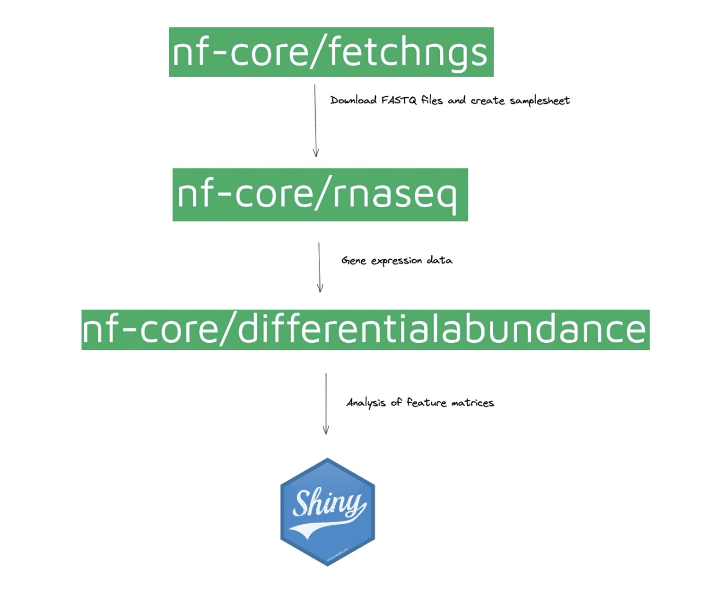

### SEMINAR 3: Introduction to nf-core/differential abundance pipeline

Video link: https://vimeo.com/824613336?share=copy 
  

#### **Presenter: Patricia, Talya, Abhinav**



#### **Links/Resources used:**

1. nf-core tools docs [https://nf-co.re/tools/](https://nf-co.re/tools/)

  

2. MutltiQC: [https://multiqc.info/](https://multiqc.info/)

  

3. MegaQC: [https://megaqc.info/](https://megaqc.info/)

  

4. `nf-core/fetchngs` pipeline
    1. Main page: [https://nf-co.re/fetchngs](https://nf-co.re/fetchngs)
    2. Usage: [https://nf-co.re/fetchngs/1.9/usage](https://nf-co.re/fetchngs/1.9/usage)
    3. Parameters: [https://nf-co.re/fetchngs/1.9/parameters](https://nf-co.re/fetchngs/1.9/parameters)
    4. AWS test results: [https://nf-co.re/fetchngs/results#fetchngs/results-084e5ef3038b3210efaf203ce57d0ba21a6ece0b/](https://nf-co.re/fetchngs/results#fetchngs/results-084e5ef3038b3210efaf203ce57d0ba21a6ece0b/)
    5. Output docs: [https://nf-co.re/fetchngs/1.9/output](https://nf-co.re/fetchngs/1.9/output)
    6. Slack channel: `#fetchngs` [https://nfcore.slack.com/channels/fetchngs](https://nfcore.slack.com/channels/fetchngs)

  

5. `nf-core/differentialabundance` pipeline
    1. Main page: [https://nf-co.re/differentialabundance](https://nf-co.re/differentialabundance)
    2. Usage: [https://nf-co.re/differentialabundance/1.2.0/usage](https://nf-co.re/differentialabundance/1.2.0/usage)
    3. Parameters: [https://nf-co.re/differentialabundance/1.2.0/parameters](https://nf-co.re/differentialabundance/1.2.0/parameters)
    4. AWS test results: [https://nf-co.re/differentialabundance/results#differentialabundance/results-3a849f046990707cad2a0df751c371ac7f1165ab/](https://nf-co.re/differentialabundance/results#differentialabundance/results-3a849f046990707cad2a0df751c371ac7f1165ab/)
    5. Output docs: [https://nf-co.re/differentialabundance/1.2.0/output](https://nf-co.re/differentialabundance/1.2.0/output)
    6. Slack channel `#differentialabundance` [https://nfcore.slack.com/channels/differentialabundance](https://nfcore.slack.com/channels/differentialabundance)

  

6. `nf-core/rnaseq` pipeline
    1. Main page: [https://nf-co.re/rnaseq](https://nf-co.re/rnaseq)
    2. Usage: [https://nf-co.re/rnaseq/3.11.1/usage](https://nf-co.re/rnaseq/3.11.1/usage)
    3. Parameters: [https://nf-co.re/rnaseq/3.11.1/parameters](https://nf-co.re/rnaseq/3.11.1/parameters)
    4. AWS test results: [https://nf-co.re/rnaseq/results](https://nf-co.re/rnaseq/results)
    5. Output docs: [https://nf-co.re/rnaseq/3.11.1/output](https://nf-co.re/rnaseq/3.11.1/output)
    6. Slack channel `#rnaseq`

7. Computational experiment design
    
    1. Folder structure
    
    ```
    ├── data
    ├── params
    │   ├── exp1
    │   │   ├── diffabun.yml
    │   │   ├── fetchngs.yml
    │   │   └── rnaseq.yml
    │   └── exp2
    ├── results
    │   ├── exp1
    │   └── exp2
    └── samplesheets
        ├── fetchngs_sample_ids.txt
        └── rnaseq.100samples.csv


    ```

    2. Pipeline specific options should be kept in a `yml` files for each experiment, for example:
     
    ```yaml
 
    #---------------------
    # fetchngs
    #---------------------
    outdir: data/
    input: samplesheets/fetchngs_sample_ids.txt
    max_memory: 6.GB
    force_sratools_download: true
    nf_core_pipeline: rnaseq


    #---------------------
    # rnaseq
    #---------------------

    input: rnaseq.100samples.csv
    outdir: results/exp1/rnaseq
    genome: GRCh37


    #---------------------
    # differentialabundance
    #---------------------

    shinyngs_deploy_to_shinyapps_io: true
    shinyngs_shinyapps_account: abhi18av
    shinyngs_shinyapps_app_name: diffabun-1

    ```


    3. Nextflow specific options should be kept in the command line
     
    ```bash

 
    #---------------------
    # fetchngs
    #---------------------

   
    nextflow run nf-core/fetchngs \
        -r 1.9 \
        -profile docker \
        -resume \
        -params-file params/exp1/fetchngs.yml


    #---------------------
    # rnaseq
    #---------------------

    nextflow run nf-core/rnaseq \
        -r 3.11.2 \
        -profile docker \
        -resume \
        --params-file params/exp1/rnaseq.yml


    #---------------------
    # differentialabundance
    #---------------------

    nextflow run nf-core/differentialabundance \
        -r 1.2.0 \
        -profile rnaseq,docker \
        -resume \
        --params-file params/exp1/diffabun.yml

    ```
